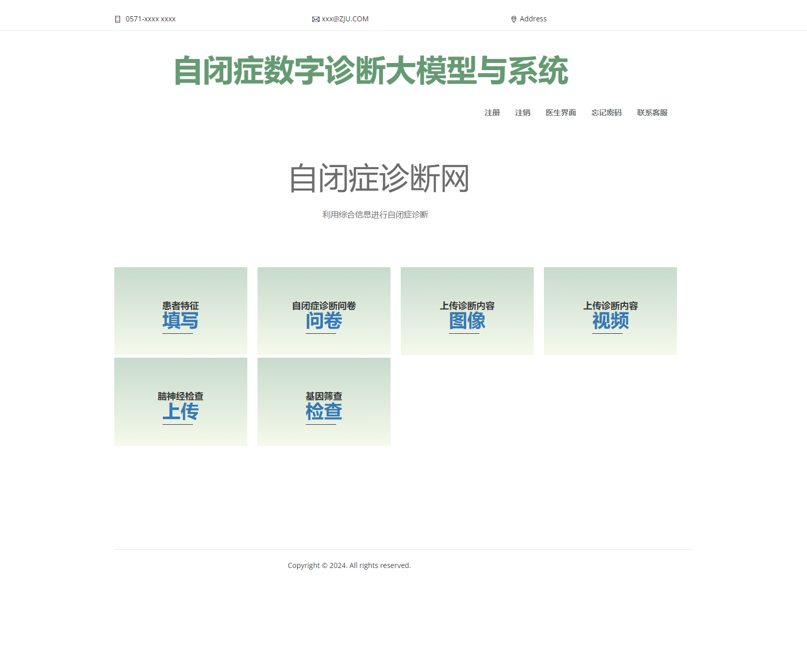
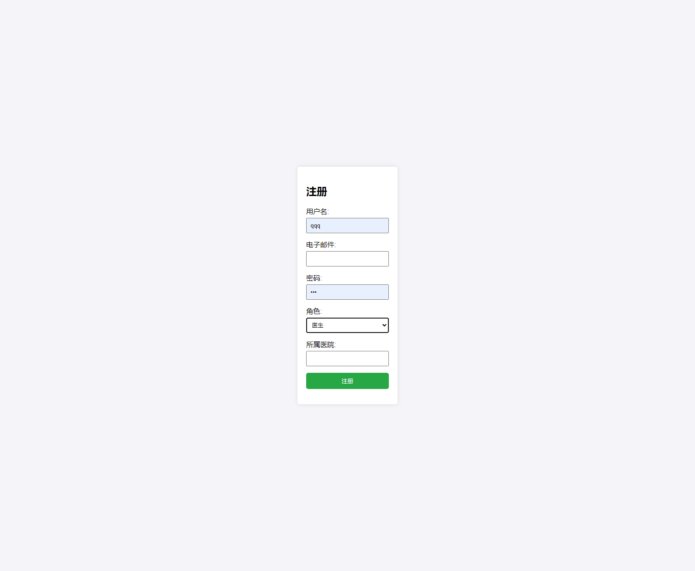
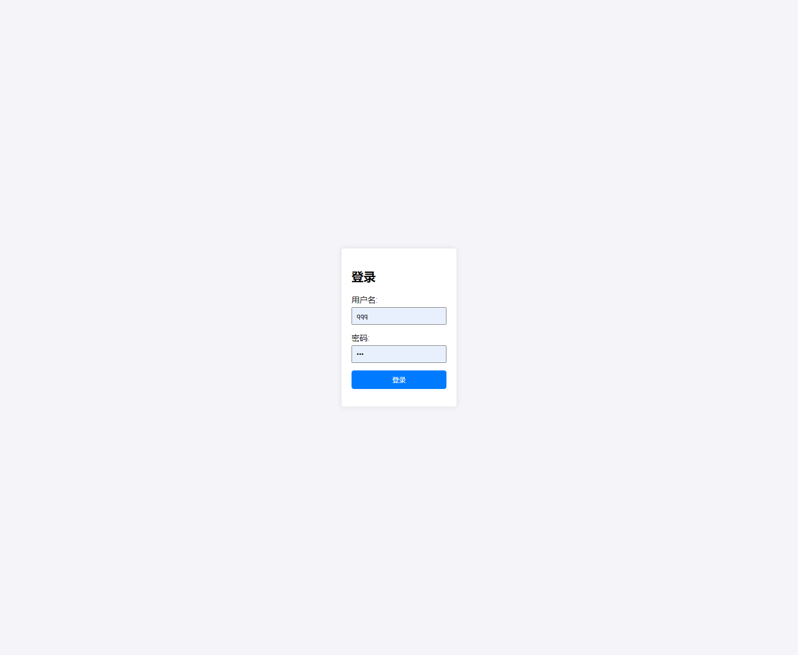
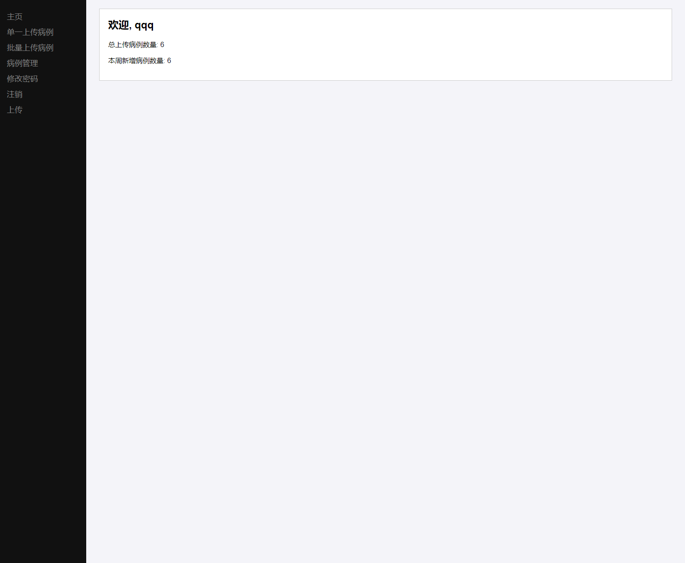
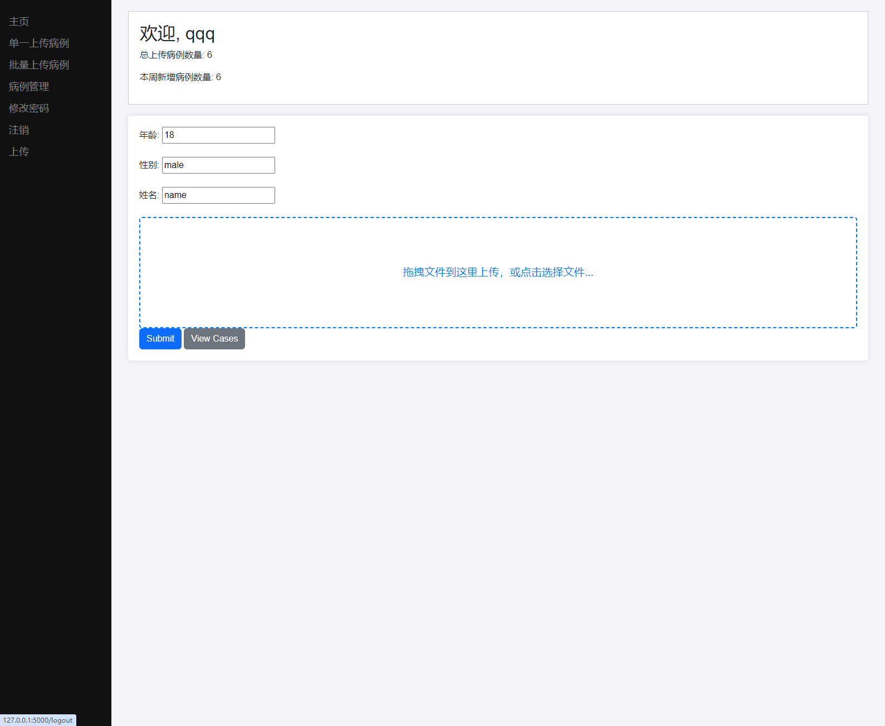
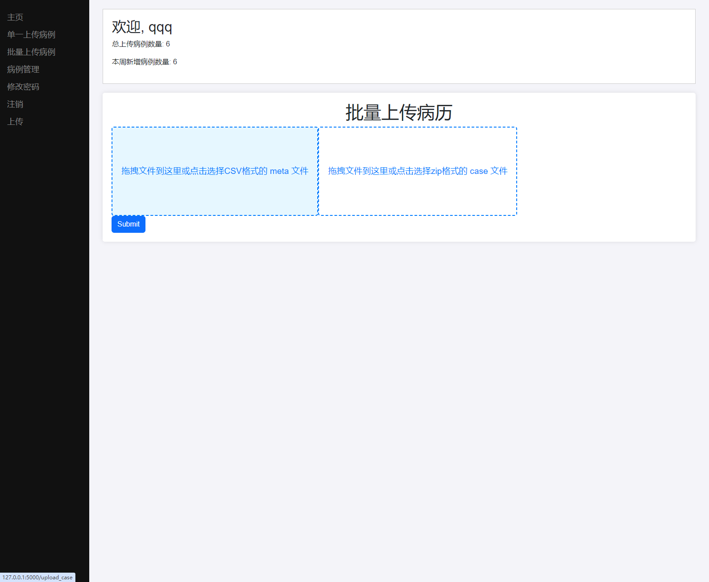
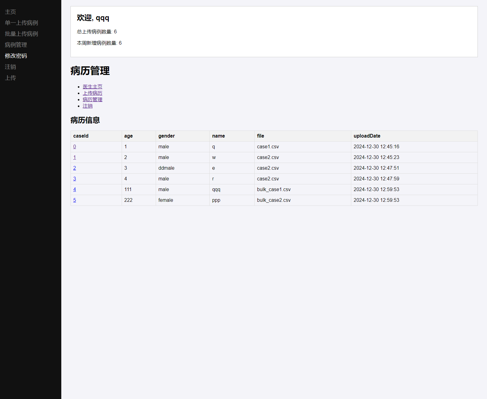
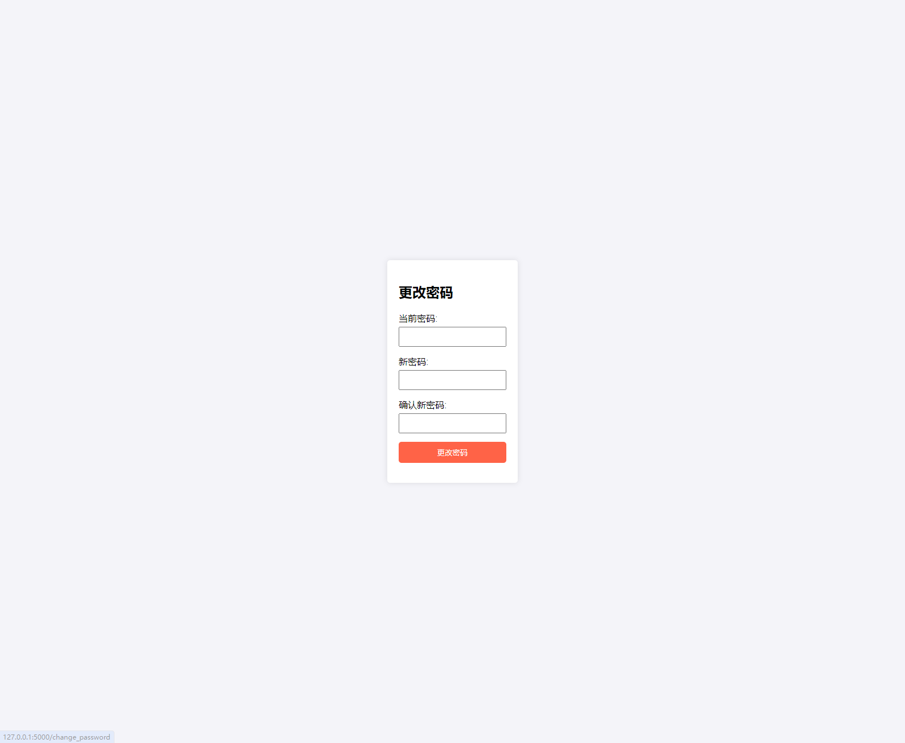

# asd_webproject

## 项目简介

利用Flask搭建的自闭症病历管理网站。使用了flask框架构建网站，前端使用css等渲染。

功能实现用户管理，病历上传，病历管理，医生账户管理。
###预留诊断功能，管理员管理功能，首页功能入口保留

###项目首页，如图所示 
###注册界面，如图所示
###登录界面，如图所示
###用户（医生）界面，如图所示
###单一病历上传界面，如图所示
###批量病历上传界面，如图所示
###病历管理界面，如图所示
###修改密码界面，如图所示

## 开发环境

- Python == 3.10.4
剩余安装包在requirements.txt中

